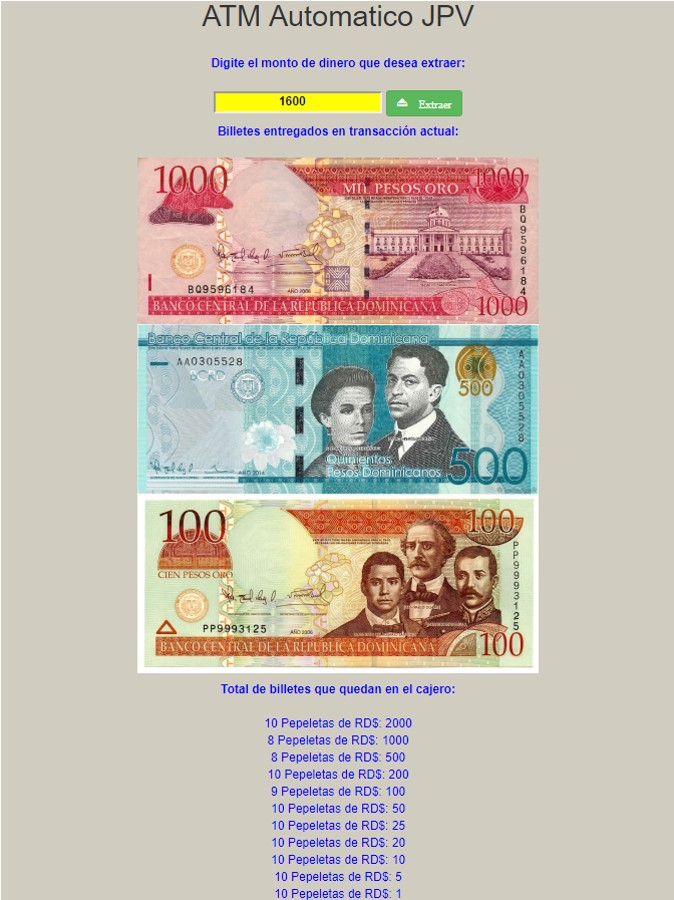

# MI-Cajero-ATM
Cajero HTML, CSS, y JavaScript

Este es un Proyecto del Curso de Programacion Basica de Platzi, donde muestra el uso de Codigo HTML, CSS y Javascripts, 
y las funciones y operaciones matematicas, asi como algunos trucos con estruras repetivas.

El codigo lo modifique y actualice a mi pais Republica Dominicana, usando tambien el dinero dominicano, asi como otros billetes 
de mi pais que ya no estan en vigencias, pero que me parecio muy exelente para tenerlo guardado y verlo en liena.

Espero les guste.

# Imagen del Cajero

URL DEL PROYECTO: https://juancitopena.github.io/MI-Cajero-ATM/
